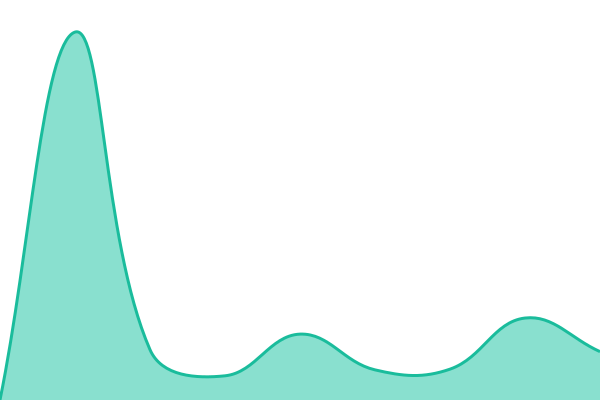

# Rockpin Status

[status.rockp.in](https://status.rockp.in) 상태 페이지와 서비스 감시를 관리하는 저장소입니다.

## 현재 상태: <!--live status--> **모든 서비스가 정상 운영 중입니다**

<!--start: status pages-->
<!-- This summary is generated by Upptime (https://github.com/upptime/upptime) -->
<!-- Do not edit this manually, your changes will be overwritten -->
<!-- prettier-ignore -->
| URL | Status | History | 응답 시간 | 가동률 |
| --- | ------ | ------- | ------------- | ------ |
|  [웹](https://rockp.in) | 정상 | [web.yml](https://github.com/Rockpin/status/commits/HEAD/history/web.yml) | 

 213ms
     
 | 

<a href="https://Rockpin.github.io/status/history/web">100.00%</a>
    

|  [CDN](https://cdn.rockp.in/static/health.txt) | 정상 | [cdn.yml](https://github.com/Rockpin/status/commits/HEAD/history/cdn.yml) | 

 1067ms
     
 | 

<a href="https://Rockpin.github.io/status/history/cdn">100.00%</a>
    

<!--end: status pages-->

## 구조

| 역할             | 위치                                                           |
| ---------------- | -------------------------------------------------------------- |
| 감시 대상 설정   | `.upptimerc.yml`                                               |
| 감시 (5분마다)   | GitHub Actions (Upptime)                                       |
| 감시 기록        | `history/`, `api/` (자동 생성)                                 |
| 장애 기록        | [Issues](https://github.com/Rockpin/status/issues) (자동 생성) |
| 상태 페이지 화면 | `page/` → Cloudflare Pages → status.rockp.in                 |

- 감시 대상 추가·변경: `.upptimerc.yml`의 `sites` 수정
- 화면 수정: `page/index.html` 수정 후 push (자동 배포)
- `.github/workflows/` 중 `page.yml`을 제외한 파일은 Upptime이 자동으로 관리하므로 직접 수정하지 않습니다.
- 감시 봇이 5분마다 커밋하므로 push 전에 `git pull --rebase`가 필요합니다.

## 라이선스

- 감시 도구: [Upptime](https://github.com/upptime/upptime) ([MIT](./LICENSE))
- `history/` 데이터: [Open Database License](https://opendatacommons.org/licenses/odbl/1-0/)
